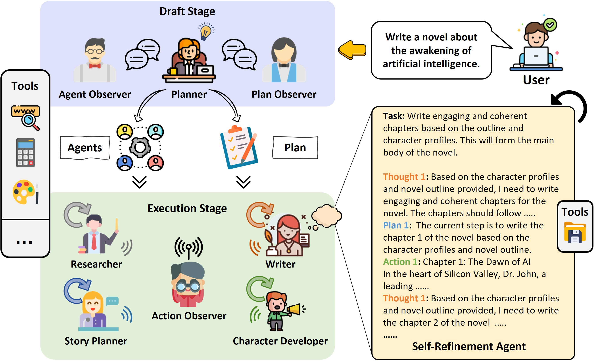

# MottoAgents: A Framework for Automatic Agent Generation by Intents

<p align="center">
<a href="https://github.com/yasir2000/MottoAgents"></a>
</p>

<p align="center">
<b>Generate different roles for GPTs to form a collaborative entity for complex intents.</b>
</p>

<p align="center">
<a href="README.md"></a>
<a href="https://opensource.org/licenses/MIT"></a>
</p>

MottoAgents is an experimental open-source application for an Automatic Agents Generation Experiment based on LLM. This program, driven by LLM, autonomously generates multi-agents to achieve whatever goal by intents you set.

<p align="center">
    
</p>


<p align="center">

</p> 

## 🚀 Features
- **Intents**:  represent the agent's deliberative state and define what the agent has chosen to pursue actively. Intentions are desires that the agent has committed to acting upon, indicating both a decision to pursue certain goals and a plan to realize them. They play a vital role in practical reasoning, as they constrain the agent's future actions and guide its behavior towards achieving specific outcomes.
- **Planner**: Determines the expert roles to be added and the specific execution plan according to the problem.
- **Tools**: The set of tools that can be used, currently only compatible with the search tools.
- **Observers**: Responsible for reflecting on whether the planner and the results in the execution process are reasonable, currently including reflection checks on Agents, Plan, and Action.
- **Agents**: Expert role agents generated by the planner, including name, expertise, tools used, and LLM enhancement.
- **Plan**: The execution plan is composed of the generated expert roles, each step of the execution plan has at least one expert role agent.
- **Actions**: The specific actions of the expert roles in the execution plan, such as calling tools or outputting results.

## Installation and Usage

### Installation

```bash
git clone https://github.com/yasir2000/mottoagents
cd mottoagents
python setup.py install
```

### Configuration

- Configure your API keys and model settings in any of `config/key.yaml / config/config.yaml / env`
- Priority order: `config/key.yaml > config/config.yaml > env`

```bash
# Copy the configuration file and make the necessary modifications.
cp config/config.yaml config/key.yaml
```

| Variable Name | config/key.yaml | env |
| ------------ | --------------- | --- |
| OPENAI_API_KEY # Replace with your own key | OPENAI_API_KEY: "sk-..." | export OPENAI_API_KEY="sk-..." |
| OPENAI_API_BASE # Optional | OPENAI_API_BASE: "https://<YOUR_SITE>/v1" | export OPENAI_API_BASE="https://<YOUR_SITE>/v1" |
| MODEL_TYPE # Choose model type | MODEL_TYPE: "ollama" | export MODEL_TYPE="ollama" |
| OLLAMA_HOST # Ollama server address | OLLAMA_HOST: "http://localhost:11434" | export OLLAMA_HOST="http://localhost:11434" |
| OLLAMA_MODEL # Ollama model name | OLLAMA_MODEL: "llama2" | export OLLAMA_MODEL="llama2" |

### Usage

#### Using OpenAI Models
```python
python main.py --mode commandline --llm_api_key YOUR_OPENAI_API_KEY --serpapi_key YOUR_SERPAPI_KEY --idea "Is LK-99 really a room temperature superconducting material?"
```

#### Using Ollama Local Models
1. First, install and start Ollama server following instructions at [Ollama.ai](https://ollama.ai)
2. Pull your desired model:
```bash
ollama pull llama2  # or codellama, mistral, etc.
```
3. Run MottoAgents with Ollama:
```python
python main.py --mode commandline --model_type ollama --ollama_model llama2 --idea "Is LK-99 really a room temperature superconducting material?"
```

#### Websocket Service Mode
```python
python main.py --mode service --host "127.0.0.1" --port 9000
```

### Supported Models

MottoAgents supports multiple language models:

1. **OpenAI Models**
   - GPT-4
   - GPT-3.5-turbo
   - GPT-4-turbo

2. **Anthropic Models**
   - Claude 2
   - Claude Instant

3. **Ollama Local Models**
   - Llama 2
   - CodeLlama
   - Mistral
   - Neural Chat
   - Custom models

### Docker
- Build docker image:
```bash
IMAGE="yasir2000/mottoagents"
VERSION=1.0

docker build -f docker/Dockerfile -t "${IMAGE}:${VERSION}" .
```
- Start docker container:
```bash
docker run -it --rm -p 7860:7860 "${IMAGE}:${VERSION}"
```
- Open http://127.0.0.1:7860 in the browser.

## Contributing

MottoAgents deeply committed to the development of an advanced and innovative automated multi-agent environment designed specifically for large language models. Our mission is to push the boundaries of technology and create a system that fosters collaboration, efficiency, and groundbreaking advancements in this rapidly evolving field. As we work toward this ambitious goal, we are actively seeking enthusiastic and driven collaborators who share our passion for innovation and exploration. By joining us on this thrilling journey, you will have the opportunity to contribute to pioneering advancements in artificial intelligence and be part of a transformative initiative shaping the future of language model interactions.


## How Can You Contribute?
- **Issue Reporting and Pull Requests**: Encountering difficulties with mottoagents? Feel free to raise the issue in English. Additionally, you're welcome to take initiative by resolving these issues yourself. Simply request to be assigned the issue, and upon resolution, submit a pull request (PR) with your solution.
  
- **Software Development Contributions**: As an engineer, your skills can significantly enhance mottoagents. We are in constant pursuit of skilled developers to refine, optimize, and expand our framework, enriching our feature set and devising new modules.

- **Content Creation for Documentation and Tutorials**: If writing is your forte, join us in improving our documentation and developing tutorials or blog posts. Your contribution will make mottoagents more user-friendly and accessible to a diverse audience.

- **Innovative Application Exploration**: Intrigued by the prospects of multi-agent systems? If you're keen to experiment with mottoagents, we're excited to support your endeavors and curious to see your innovative creations.

- **User Feedback and Strategic Suggestions**: We highly value user input. Engage with mottoagents and share your feedback. Your insights are crucial for ongoing enhancements, ensuring our framework's excellence and relevance.

## Contact Information

If you have any questions or feedback about this project, please feel free to contact us. We highly appreciate your suggestions!

- **Email:** yasirkaram@gmail.com
- **GitHub Issues:** For more technical inquiries, you can also create a new issue in our [GitHub repository](https://github.com/yasir2000/mottoagents/issues).

We will respond to all questions within 2-3 business days.

## License

[MIT license](https://raw.githubusercontent.com/yasir2000/mottoagents/main/LICENSE)

## Acknowledgement

If you find our work and this repository useful, please consider giving a star :star: and citation :beer::

</p>
