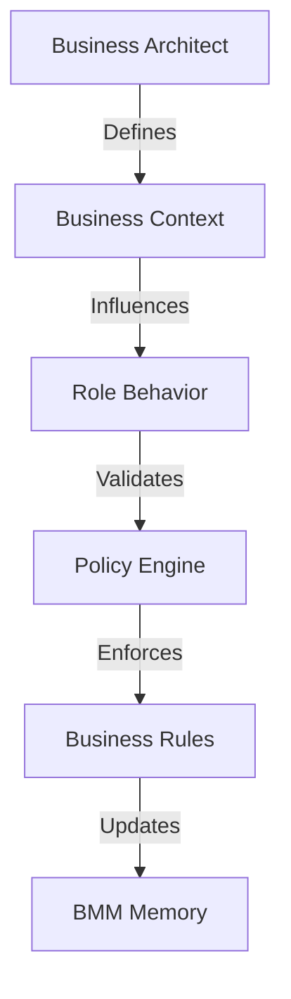

# MottoAgents Project Documentation

## Table of Contents
1. [Introduction](#introduction)
2. [Project Structure](#project-structure)
3. [Core Components](#core-components)
4. [System Architecture](#system-architecture)
5. [Configuration](#configuration)
6. [Role System](#role-system)
7. [Actions](#actions)
8. [Tools and Utilities](#tools-and-utilities)
9. [API Documentation](#api-documentation)
10. [Setup and Installation](#setup-and-installation)

## Introduction

MottoAgents is an AI-powered agent system that enables the creation and management of autonomous agents with specific roles and capabilities. The system is built on top of large language models and provides a flexible framework for implementing various AI-driven tasks and workflows.

## Project Structure

```
mottoagents/
├── actions/            # Action definitions and implementations
│   └── action_bank/   # Pre-built actions
├── roles/             # Role definitions and implementations
│   └── role_bank/    # Pre-built roles
├── system/            # Core system components
│   ├── config/       # Configuration management
│   ├── logs/         # Logging utilities
│   ├── memory/       # Memory management
│   ├── tools/        # System tools and utilities
│   └── utils/        # Common utilities
├── frontend/          # Web interface components
├── docker/           # Docker configuration
└── config/           # Configuration files
```

## Core Components

### 1. Role System
The role system is the foundation of MottoAgents, implementing autonomous agents with specific capabilities:

- **Base Role Class**: Defines the core functionality for all roles
  - State management
  - Action execution
  - Memory handling
  - Environment interaction

- **Role Context**: Maintains runtime state and memory for each role
  - Short-term and long-term memory
  - Environment references
  - Action monitoring

- **Role Settings**: Configures role behavior and characteristics
  - Name and profile
  - Goals and constraints
  - Description and capabilities

### 2. Actions
Actions represent specific tasks that roles can perform:

- **WriteDesign**: Creates system designs from PRDs
  - API definitions
  - Data structures
  - System architecture
  - Implementation approaches

- **WriteCode**: Implements code based on designs
  - Code generation
  - Code review
  - File management

### 3. Memory System
Implements both short-term and long-term memory for roles:

- **Short-term Memory**: Temporary storage for ongoing operations
- **Long-term Memory**: Persistent storage for important information
- **Memory Management**: Filtering and retrieval of relevant information

### 4. Tools and Utilities

#### Search Engine Integration
- Multiple search engine support:
  - Direct Google search
  - SerpAPI integration
  - Serper integration
  - Custom search implementations

#### Output Parsing
- Block parsing for structured text
- Code extraction and formatting
- File list parsing
- Data structure parsing

#### Configuration Management
- YAML-based configuration
- Environment variable support
- API key management
- Service configuration

## System Architecture

### Components Interaction
1. **Role Initialization**
   - Role creation with specific settings
   - Action initialization
   - Memory setup

2. **Action Execution Flow**
   ```mermaid
   sequenceDiagram
       participant Role
       participant Action
       participant Memory
       participant Environment
       
       Role->>Action: Execute action
       Action->>Memory: Access context
       Action->>Environment: Interact
       Environment->>Memory: Store results
       Memory->>Role: Update state
   ```

3. **Memory Management Flow**
   ```mermaid
   sequenceDiagram
       participant Role
       participant ShortTermMemory
       participant LongTermMemory
       participant ActionMonitor
       
       Role->>ActionMonitor: Watch actions
       ActionMonitor->>ShortTermMemory: Store events
       ShortTermMemory->>LongTermMemory: Persist important data
       Role->>ShortTermMemory: Query recent
       Role->>LongTermMemory: Query historical
   ```

## Configuration

### Environment Variables
- `OPENAI_API_KEY`: OpenAI API key
- `SERPAPI_API_KEY`: SerpAPI key
- `GOOGLE_API_KEY`: Google API key
- `GOOGLE_CSE_ID`: Google Custom Search Engine ID

### YAML Configuration
```yaml
GLOBAL_PROXY: ""
OPENAI_API_BASE: "https://api.openai.com/v1"
OPENAI_API_MODEL: "gpt-4"
MAX_TOKENS: 2048
LONG_TERM_MEMORY: false
MAX_BUDGET: 10.0
```

## Role System

### Role Creation
```python
role = Role(
    name="Engineer",
    profile="Software Engineer",
    goal="Write efficient code",
    constraints="Follow PEP8"
)
```

### Action Registration
```python
role._init_actions([WriteCode])
role._watch([WriteTasks])
```

### State Management
```python
role._set_state(new_state)
role._rc.memory.add(message)
```

## Actions

### WriteDesign Action
- Processes PRD documents
- Generates system architecture
- Creates API definitions
- Produces implementation plans

### WriteCode Action
- Implements designed systems
- Follows coding standards
- Performs code reviews
- Manages file organization

## Tools and Utilities

### Search Engine
```python
search = SearchEngine()
results = await search.run("query", max_results=8)
```

### Output Parser
```python
parser = OutputParser()
blocks = parser.parse_blocks(text)
code = parser.parse_code(text, lang="python")
```

## API Documentation

### Role API
```python
class Role:
    def __init__(self, name, profile, goal, constraints)
    def set_env(self, env)
    async def run(self, message)
    async def handle(self, message)
```

### Action API
```python
class Action:
    def __init__(self, name, context, llm)
    async def run(self, context)
```

### Memory API
```python
class Memory:
    def add(self, message)
    def get(self)
    def get_by_actions(self, actions)
```

## Business Motivation Model Integration

### BMM-Enhanced Role System
The role system now incorporates BMM concepts for business-aligned decision making:

```python
class BMMRole(Role):
    def __init__(self, name, profile, **kwargs):
        super().__init__(name, profile)
        self.bmm_context = {
            "ends": {
                "vision": kwargs.get("vision", ""),
                "goals": kwargs.get("goals", []),
                "objectives": kwargs.get("objectives", {})
            },
            "means": {
                "mission": kwargs.get("mission", ""),
                "strategy": kwargs.get("strategy", []),
                "tactics": kwargs.get("tactics", {})
            },
            "influencers": {
                "internal": kwargs.get("internal_influences", []),
                "external": kwargs.get("external_influences", [])
            },
            "assessments": {
                "swot": kwargs.get("swot_analysis", {}),
                "evaluations": kwargs.get("evaluations", [])
            },
            "directives": {
                "policies": kwargs.get("business_policies", []),
                "rules": kwargs.get("business_rules", {})
            }
        }
```

### BMM Action Framework
Actions are now context-aware of business motivations:

```python
class BMMAction(Action):
    async def evaluate_context(self, context):
        """Evaluate action against BMM directives"""
        policies = self._rc.bmm_context["directives"]["policies"]
        rules = self._rc.bmm_context["directives"]["rules"]
        return self.validate_compliance(context, policies, rules)

    async def align_with_strategy(self, action_plan):
        """Ensure action aligns with business strategy"""
        strategy = self._rc.bmm_context["means"]["strategy"]
        return self.validate_strategic_fit(action_plan, strategy)
```

### BMM-Aware Memory System
Enhanced memory system with business context awareness:

```python
class BMMMemory(Memory):
    def add_with_context(self, message, bmm_context):
        """Store memory with BMM context"""
        enriched_message = self.enrich_with_bmm(message, bmm_context)
        self.add(enriched_message)

    def get_by_objective(self, objective_id):
        """Retrieve memories related to specific objectives"""
        return self.filter_by_bmm_context("objectives", objective_id)
```

## Business Motivation Model (BMM) Architecture

### Core Components

1. **BMM Context**
   - Business vision and goals
   - Strategy and tactics
   - Policies and rules
   - Influencer assessment

2. **Business Architect Role**
   - Strategy development
   - Policy enforcement
   - Objective tracking
   - Context analysis

3. **BMM Memory System**
   - Context-aware storage
   - Strategic indexing
   - Objective-based retrieval

### Integration Flow


## Setup and Installation

1. Clone the repository
```bash
git clone <repository-url>
```

2. Install dependencies
```bash
pip install -r requirements.txt
```

3. Configure environment
```bash
cp config/config.yaml.example config/config.yaml
# Edit config.yaml with your settings
```

4. Run the system
```bash
python main.py
```

## Best Practices

1. **Role Development**
   - Define clear goals and constraints
   - Implement specific actions
   - Handle state transitions

2. **Action Implementation**
   - Follow single responsibility principle
   - Include proper error handling
   - Document inputs and outputs

3. **Memory Management**
   - Use appropriate memory type
   - Clean up unnecessary data
   - Implement proper persistence

4. **Configuration**
   - Use environment variables for secrets
   - Keep configuration versioned
   - Document all options

## Contributing

1. Fork the repository
2. Create a feature branch
3. Implement changes
4. Submit pull request

## License

This project is licensed under the terms specified in the LICENSE file.

---

For more information, please refer to the individual component documentation or contact the project maintainers.